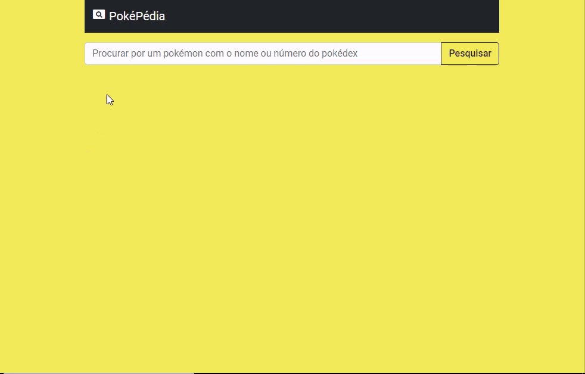

# PokePidia :space_invader:

	PokePidia is a simple example of an API consuming data from [PokéAPI](https://pokeapi.co) with JS.

<h4 align="center"> 
	🚧  Stopped  🚧
</h4>

 <a href="#demonstration">Demonstration</a> •
 <a href="#how">How it works</a> •
 <a href="#usage">Usage</a> • 
 <a href="#technologies">Technologies Versions</a> • 
 <a href="#license">License</a>  

## Demonstration :desktop_computer:

<h1 align="center">
  
</h1>

### Features

- [x] API answer 
- [ ] Animations focusing on the pokemon's type
- [ ] Mini Pokemon library

### How it works

1. Open any browser (recommend Google Chrome)
2. Select any index.html inside the projects 
3. Done! 🚀

## Technologies Versions 🛠 : 

- HTML 5
- CSS 3
- Boostrap 5
- ECMA 6

## License :roll_of_paper:

[MIT](./LICENSE)